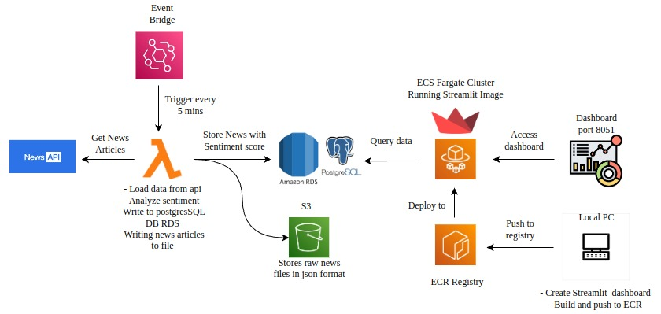

# News Sentiment Data Pipeline

An end-to-end automated data pipeline that ingests live news articles every 5 minutes, scores their sentiment, and displays the results on a real-time analytics dashboard — built entirely on AWS.

---

## Architecture



---

## Tech Stack

| Service                  | Purpose                                        |
| ------------------------ | ---------------------------------------------- |
| AWS EventBridge          | Scheduled trigger (every 5 minutes)            |
| AWS Lambda (Python)      | Fetch news, score sentiment, write to S3 + RDS |
| NewsAPI                  | Live news data source                          |
| VADER (`vaderSentiment`) | Sentiment scoring                              |
| AWS S3                   | Raw data storage (JSON backup/audit trail)     |
| AWS RDS (PostgreSQL)     | Structured, query-ready article storage        |
| Docker                   | Containerizes the dashboard app                |
| AWS ECR                  | Container image registry                       |
| AWS ECS (Fargate)        | Runs the dashboard as a live service           |
| Streamlit                | Analytics dashboard                            |

---

## Pipeline Flow

```
EventBridge (5-minute schedule)
        ↓
Lambda → fetches articles from NewsAPI
        ↓
VADER → scores sentiment (positive / negative / neutral)
        ↓
Raw JSON → S3 (backup/audit trail)
        ↓
Structured rows → RDS PostgreSQL (news_articles table)
        ↓
ECS Fargate (Dockerized Streamlit dashboard) reads from RDS
        ↓
Live public dashboard
```

## Project Structure

```
news-data-pipeline/
├── lambda/                 # Ingestion function (deployed to AWS Lambda)
│   ├── app.py               # Entry point (lambda_handler)
│   ├── news_api.py          # Fetches articles from NewsAPI
│   ├── sentiment.py         # Scores sentiment using VADER
│   ├── s3_upload.py         # Archives raw JSON to S3
│   ├── db.py                # PostgreSQL connection (psycopg2)
│   ├── config.py            # API key configuration
│   └── requirements.txt
│
├── dashboard/               # Streamlit dashboard (deployed to ECS Fargate)
│   ├── app.py                # Reads from RDS, renders charts
│   ├── Dockerfile
│   └── requirements.txt
│
├── sql/
│   └── create_table.sql      # Database schema
│
├── architecture/
│   └── architecture1.jpeg    # Pipeline architecture diagram
│
└── README.md
```

## Dashboard Features

- KPI summary: total articles, most common sentiment, distinct sources
- Sentiment breakdown (positive / negative / neutral)
- Sentiment trend over time
- Sentiment comparison across news sources
- Live table of the latest articles

## Running Locally

**Dashboard:**

```bash
cd dashboard
python -m venv venv
source venv/bin/activate      # Windows: venv\Scripts\activate
pip install -r requirements.txt
streamlit run app.py
```

Requires a `.env` file in `dashboard/` with:

```
DB_HOST=<your-postgres-host>
DB_PORT=5432
DB_NAME=<your-db-name>
DB_USER=<your-db-user>
DB_PASSWORD=<your-db-password>
```

**Lambda function** (tested locally as a plain script before packaging for deployment):

```bash
cd lambda
python -m venv venv
source venv/bin/activate
pip install -r requirements.txt
python app.py
```

Requires a `.env` file in `lambda/` with the same database variables above, plus:

```
NEWS_API_KEY=<your-newsapi-key>
AWS_REGION=<your-region>
S3_BUCKET_NAME=<your-bucket-name>
```

## Deployment Notes

- The Lambda function is packaged with Linux-compatible dependencies (`pip install --platform manylinux2014_x86_64 --only-binary=:all:`) since AWS Lambda runs on Linux regardless of the development machine's OS.
- The dashboard is built as a Docker image, pushed to Amazon ECR, and run as an ECS Fargate service for continuous availability.
- Database credentials are injected via environment variables at the Lambda/ECS level — no secrets are stored in the repository (`.env` files are git-ignored).

## Engineering Challenges Solved

- **Cross-platform dependency mismatch:** `psycopg2` compiled for Windows failed on Lambda's Linux runtime — resolved by explicitly targeting the Linux platform during packaging.
- **Read-only Lambda filesystem:** local file writes failed in Lambda since only `/tmp` is writable there — redirected accordingly.
- **Network debugging:** used AWS Reachability Analyzer to systematically verify security groups, network ACLs, and routing when the dashboard was initially unreachable, isolating the issue to a local network/ISP port restriction rather than an AWS misconfiguration.

## License

Personal portfolio project — built for learning and demonstration purposes.

---

## Author

**Vidhya Sugathan**
Data Engineer | AWS | Python | SQL | Docker
[LinkedIn](https://www.linkedin.com/in/vidhya-sugathan) | [Portfolio](https://vidhyasugathan.vercel.app)
